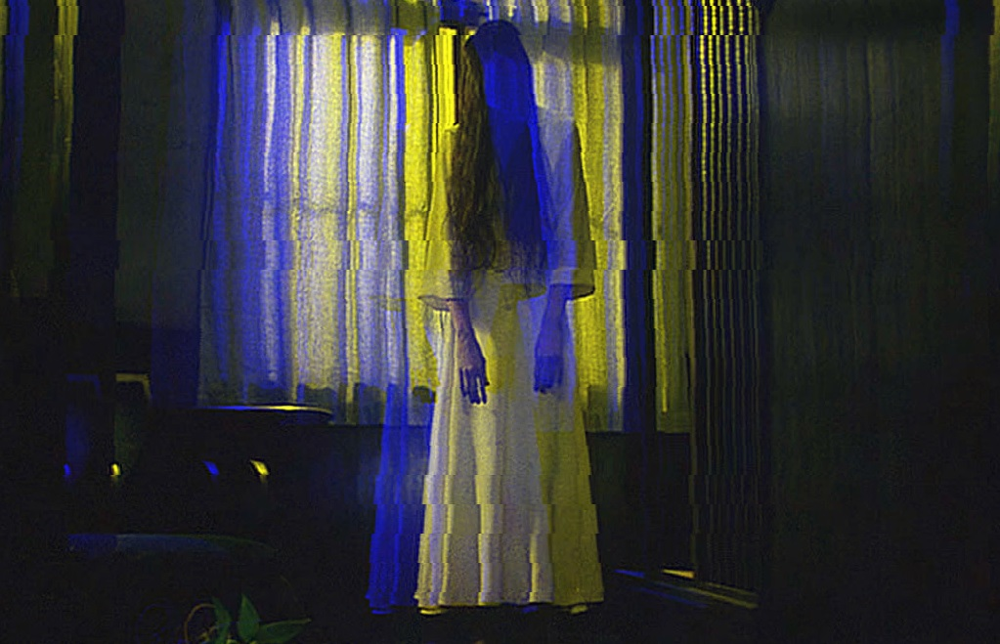

# KhuzaimahGlitcher
Class for creating a glitch animation with an image file(s).

>  glitcher.glitch( 'http://vignette2.wikia.nocookie.net/monsterspedia/images/2/28/SadakoDrapes-paper.jpg/revision/latest?cb=20140417231402', function () { 
>   document.body.appendChild( glitcher.canvas ); 
>  }); 
>  function randomRange(min, max) { 
>   return Math.floor(Math.random() * (max - min + 1)) + min; 
>  } 
>  setInterval(function () { 
>   glitcher.options = { 
>    color: { 
>     red: 1, 
>     green: 0.8, 
>     blue: 0.58 
>    }, 
>    stereoscopic: { 
>     red: 10 * randomRange(1, 3), 
>     green: 5 * randomRange(1, 3), 
>     blue: 30 * randomRange(1, 3) 
>    }, 
>    lineOffset: { 
>     value: 5 * randomRange(1, 3), 
>     lineHeight: 10 * randomRange(1, 3) 
>    } 
>   }; 
>   glitcher.process();  
>  }, 500);

